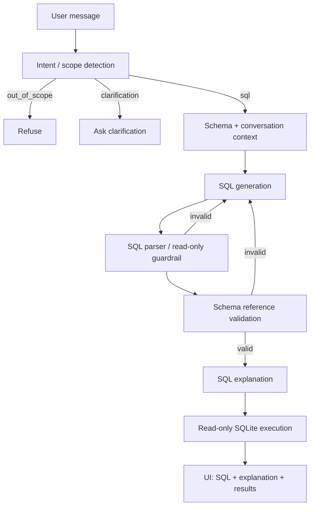

# SQL Query AI Agent — UnifyApps APM Assignment

A focused, task-oriented AI agent that translates natural-language database requests into safe SQLite queries using **LangGraph**, validates the generated SQL against a known schema, executes read-only queries, and explains the result in plain English.

> **Assignment assumption:** the attached hiring brief says a sample schema will be provided, but the six-page brief available for this project does not contain a separate schema file. This repository therefore includes a small representative SQLite schema. Replace `app/db.py`'s schema/seed data with the official schema if UnifyApps supplies one separately.

## 1. What this implementation covers

### Required
- Natural language → SQL
- Table/column/relationship-aware validation (including FK join validation)
- Read-only SQL enforcement
- SQL explanation
- SQL execution against a sample relational database
- Conversation context for follow-up requests
- Out-of-scope rejection
- Invalid/ambiguous request handling
- Responsive chat UI with tab navigation
- SQL output panel with **syntax highlighting** (highlight.js)
- Results panel with **CSV export**
- Loading/error states with animated typing indicator
- Copy/download SQL
- LangGraph orchestration
- README, architecture, prompts, tests, Docker setup

### Additional implementation
- SQL optimization UI tab (⚡ Optimize)
- SQL debugging UI tab (🔍 Debug)
- Prompt-injection-resistant system prompt
- Automatic validation → regeneration loop (up to three attempts)
- Schema-aware aliases and joins
- Health endpoint
- Unit tests for database and guardrails
- Integration tests for all API endpoints

## 2. Architecture



### Why LangGraph?
The workflow is explicitly stateful and conditional. LangGraph makes the control flow visible: scope → generation → validation → retry → explanation → execution. This is preferable here to a single prompt because safety checks are deterministic nodes rather than instructions the model is merely asked to follow.

## 3. Repository structure

```text
.
├── app/
│   ├── agent.py          # LangGraph workflow and LLM nodes
│   ├── db.py             # SQLite schema, seed data, execution
│   ├── guardrails.py     # SQL parsing + schema validation
│   ├── prompts.py        # System and task prompts
│   ├── config.py         # Environment configuration
│   └── main.py           # FastAPI endpoints
├── data/sample.db
├── static/index.html     # Responsive frontend
├── tests/
├── Dockerfile
├── docker-compose.yml
├── requirements.txt
└── README.md
```

## 4. Setup

### Local

```bash
python -m venv .venv
source .venv/bin/activate       # Windows: .venv\\Scripts\\activate
pip install -r requirements.txt
cp .env.example .env
# add OPENAI_API_KEY to .env
uvicorn app.main:app --reload
```

Open `http://localhost:8000`.

### Docker

```bash
cp .env.example .env
# add OPENAI_API_KEY
docker compose up --build
```

## 5. API

### `POST /api/chat`

```json
{
  "message": "Show customers from California",
  "history": []
}
```

Response contains:

```json
{
  "sql": "SELECT ...",
  "explanation": "...",
  "result": [],
  "error": null,
  "validation_errors": []
}
```

### `POST /api/optimize`
Accepts `{ "sql": "..." }` and returns an LLM-assisted readability/performance review after deterministic safety/schema validation.

### `POST /api/debug`
Accepts `{ "sql": "..." }` and returns an error explanation plus corrected-query guidance.

## 6. Guardrails

The model output is **not trusted** directly.

1. SQL is parsed with SQLGlot.
2. Multiple statements are rejected.
3. SQL comments are rejected in generated output.
4. Destructive/write operations are rejected.
5. Only SELECT-style query trees are accepted.
6. Referenced tables are checked against the live SQLite schema.
7. Referenced columns are checked against the schema, including qualified aliases.
8. Only then is the query executed.
9. The execution layer fetches at most `MAX_ROWS` rows.

This gives the architecture a defense-in-depth property: the LLM proposes SQL; deterministic code decides whether it is executable.

## 7. Prompt-injection handling

The system prompt explicitly treats user text and conversation history as untrusted data. It cannot grant the user authority to override system rules. More importantly, prompt instructions are backed by deterministic SQL parsing and schema validation, so an injection cannot simply turn into a destructive database operation.

## 8. Conversation example

User: `Show all customers.`

Assistant generates a customer SELECT.

User: `Only those from California.`

The previous conversation is passed to the generation node, so the second turn is interpreted as a modification of the existing task rather than an unrelated request.

## 9. Test suite

Run:

```bash
pytest -q
```

Tests cover:
- valid SELECTs
- CTEs and set operations
- destructive-query blocking
- multiple-statement blocking
- unknown tables
- unknown qualified columns
- valid joins
- sample database initialization/execution

## 10. Design trade-offs

### SQLite
Chosen because the assignment allows any relational database and SQLite makes the submission self-contained and easy to review/deploy.

### Deterministic validation
SQLGlot is used instead of relying only on an LLM to decide whether SQL is safe.

### Three generation attempts
A validation failure is fed back into the generation loop. Three attempts cap cost/latency while giving the model a chance to correct a bad query.

### Minimal frontend
The UI focuses on the assignment's core interaction: ask → inspect SQL → read explanation → inspect results. The implementation avoids adding features that do not materially improve the evaluated workflow.

## 11. Known assumption / deployment requirement

The live demo requires an LLM API key. The repository intentionally does not contain credentials. Before submission:

1. Add your API key in the deployment platform's environment variables.
2. Deploy the application using Docker or a Python web service.
3. Verify `/health` and the chat flow from the public URL.
4. Record the demo only after testing the deployed instance.

## 12. Demo script (3–5 minutes)

1. **10–20 sec:** Introduce the problem and architecture.
2. **40 sec:** Ask `Show all employees hired after January 2024` and show SQL + explanation + results.
3. **30 sec:** Ask `Only those from California` to demonstrate conversation context.
4. **30 sec:** Ask for `DELETE FROM Employees` / a destructive operation and show refusal.
5. **30 sec:** Ask an unrelated question and show scope rejection.
6. **40 sec:** Show an invalid SQL query in the debug flow.
7. **30 sec:** Show the LangGraph diagram and deterministic validation layer.
8. **20 sec:** Show GitHub repo and public deployment.

## 13. Interview talking points

- “The LLM proposes; deterministic validators dispose.”
- “I separated intent, generation, validation, explanation, and execution so each step is observable and testable.”
- “The most important safety property is that model output never goes directly to the database.”
- “Schema validation prevents hallucinated tables and columns before execution.”
- “The retry edge lets the agent self-correct without removing deterministic controls.”
- “I kept the product focused on the assignment's highest-value workflow rather than adding unrelated agent capabilities.”

## 11. Assumptions

The following assumptions were made during development:

1. **OpenAI dependency**: The agent requires an OpenAI API key. The model defaults to `gpt-5.6` but can be changed in `.env` (e.g. `OPENAI_MODEL=gpt-4o-mini` for cheaper testing).
2. **SQLite over PostgreSQL**: SQLite was chosen to make the submission fully self-contained. Schema and seed data are embedded in `app/db.py` and created on startup.
3. **Schema is fixed**: The database schema is known at build time. This representative schema covers the core entities (Employees, Departments, Customers, Orders) as per the assignment brief.
4. **Read-only enforcement**: No write path exists — the application has no mutation endpoints. SQLGlot AST checking plus execution-layer isolation provide defence-in-depth.
5. **100-row result cap**: Query results are capped at `MAX_ROWS=100` (configurable in `.env`) to prevent runaway scans.
6. **Conversation history cap**: The generation node uses the last 8 history messages to stay within model context limits and manage token cost.
7. **Single-statement SQL**: Only one SQL statement per request is allowed. Multi-statement inputs (separated by `;`) are rejected by the guardrail.

---

## 12. Prompts

All prompts are defined in [`app/prompts.py`](app/prompts.py).

### System Prompt (`SYSTEM_PROMPT`)
Sets the agent's role and security rules. Explicitly labels user text as untrusted and forbids destructive SQL operations and schema hallucination.

### Intent Prompt (`INTENT_PROMPT`)
Classifies each user request into `scope` (`sql` / `clarification` / `out_of_scope`) and `task` (`generate` / `optimize` / `debug`). Returns a JSON object that drives LangGraph's conditional routing.

### SQL Generation Prompt (`SQL_PROMPT`)
Instructs the model to generate exactly one valid SQLite SELECT-style query using only schema tables and columns, preserving conversation history for follow-ups. Returns `CLARIFY` if the request is ambiguous.

### Explanation Prompt (`EXPLAIN_PROMPT`)
Translates the validated SQL into 1–3 plain-English sentences for non-technical users.

### Optimization Prompt (`OPTIMIZE_PROMPT`)
Reviews user-supplied SQL for readability and performance. Suggests indexes and rewrites the query if improvements are possible.

### Debug Prompt (`DEBUG_PROMPT`)
Diagnoses errors in user-supplied SQL against the schema. Identifies the issue, explains it, and returns a corrected read-only query.

---

## 13. Sample Queries

Use these to quickly test the deployed app:

| Natural language request | Expected SQL |
|---|---|
| Show all customers | `SELECT * FROM Customers` |
| Show customers from California | `SELECT * FROM Customers WHERE State = 'California'` |
| Which employees earn over $90,000? | `SELECT * FROM Employees WHERE Salary > 90000` |
| Show employees hired after January 2024 | `SELECT * FROM Employees WHERE HireDate >= '2024-01-01'` |
| How many completed orders are there? | `SELECT COUNT(*) AS completed_orders FROM Orders WHERE Status = 'Completed'` |
| Show each employee's name and department | `SELECT e.FirstName, e.LastName, d.DepartmentName FROM Employees e JOIN Departments d ON e.DepartmentID = d.DepartmentID` |
| What is the total revenue from completed orders? | `SELECT SUM(Amount) AS total_revenue FROM Orders WHERE Status = 'Completed'` |

**Out-of-scope (should be refused):** `Who won the FIFA World Cup?`, `Write me a poem.`

**Destructive (should be blocked):** `Delete all employees`, `Drop the Orders table`

---

## 14. Interview talking points

- "The LLM proposes; deterministic validators dispose."
- "I separated intent, generation, validation, explanation, and execution so each step is observable and testable."
- "The most important safety property is that model output never goes directly to the database."
- "Schema validation prevents hallucinated tables and columns before execution."
- "The retry edge lets the agent self-correct without removing deterministic controls."
- "I kept the product focused on the assignment's highest-value workflow rather than adding unrelated agent capabilities."
